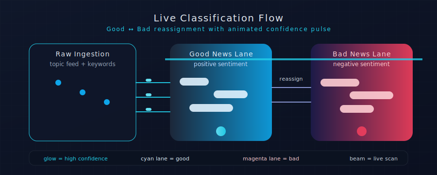
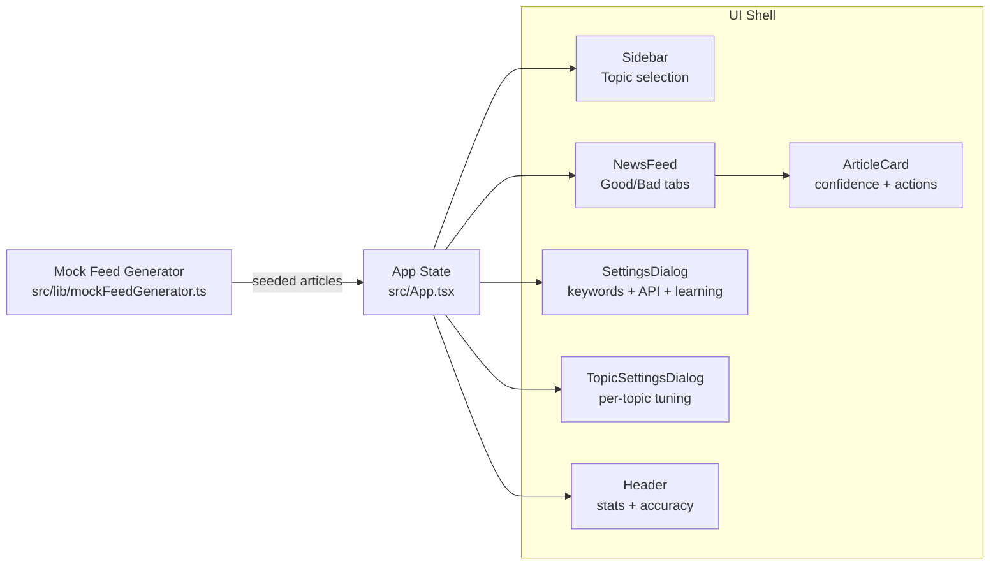
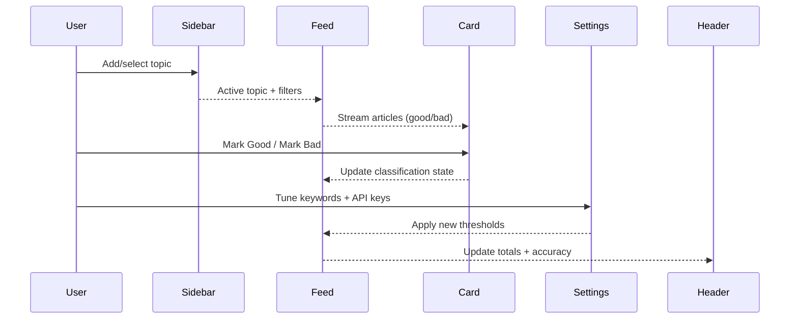

# Good News / Bad News — Cyber-Classified Reader

AI-powered news triage that separates **Good News** from **Bad News** with a cyber-metallic interface, ready for GPU-backed embeddings + RAG integration. Built with React, Vite, Tailwind, Radix UI, and shadcn.

<p align="center">
  
</p>

## Table of Contents
- [Why this project](#why-this-project)
- [Feature tour](#feature-tour)
- [Animations \& visual system](#animations--visual-system)
- [Architecture map](#architecture-map)
- [Interaction flow](#interaction-flow)
- [Getting started](#getting-started)
- [Development notes](#development-notes)
- [Theming \& customization](#theming--customization)
- [Integrating a real RAG backend](#integrating-a-real-rag-backend)
- [Troubleshooting](#troubleshooting)

## Why this project
- **Cyber-ops aesthetic**: Deep metallic blues, electric cyan glows, animated scanlines, and data-dense panels.
- **Built for correction**: Quick reassignment controls let humans fix AI sentiment calls.
- **Ready for RAG**: Swap the mock generator for GPU-accelerated embeddings + vector search without touching the UI scaffolding.

## Feature tour
- **Topic Management Sidebar** — Add, remove, and switch categories with persistent selection.
- **Dual-Feed Classification View** — Good/Bad tabs with infinite scroll for dense reading.
- **Article Cards** — Title, source, timestamp, confidence meter, and one-click “Mark Good / Mark Bad.”
- **Settings Dialogs** — Global and per-topic controls for keywords, API keys, and learning rates.
- **Live Stats Bar** — Running totals, accuracy %, and drift indicators surfaced in the header.

## Animations \& visual system
- **Shimmered steel surfaces** using `steel-shimmer` gradients.
- **Scan-line feedback** (`animate-scan`) when classification changes.
- **Glows and pulses** for active buttons, confidence dots, and tab focus.
- **Typography**: Orbitron (titles), Rajdhani (UI), Inter (body), JetBrains Mono (data).
- **Palette** (OKLCH):
  - Primary: `oklch(0.25 0.08 250)` (deep metallic blue)
  - Accent: `oklch(0.72 0.15 195)` (electric cyan)
  - Surfaces: charcoal steel + midnight black for depth/contrast
- Explore the source in [`src/styles/theme.css`](./src/styles/theme.css) for class names you can reuse.

## Architecture map


## Interaction flow


## Getting started
Prerequisites: Node 20+ recommended.

```bash
npm install        # install dependencies
npm run dev        # start Vite dev server
npm run build      # type-check (noEmit) + production build
npm run lint       # currently needs an eslint.config.js (see Troubleshooting)
```

## Development notes
- **State model**: `App.tsx` orchestrates topics, article lists, settings, and stats. Types live in [`src/types`](./src/types/index.ts).
- **UI kit**: Radix primitives + shadcn components under [`src/components/ui`](./src/components/ui).
- **Theming**: Tailwind + custom OKLCH tokens in [`src/styles/theme.css`](./src/styles/theme.css) and [`tailwind.config.js`](./tailwind.config.js).
- **Mock data**: [`src/lib/mockFeedGenerator.ts`](./src/lib/mockFeedGenerator.ts) simulates articles for the dual feeds.

## Theming \& customization
- Swap palette tokens in `theme.css` to adjust the cyber look.
- Adjust animation durations/curves in `animate-shimmer` and `animate-scan` keyframes.
- Change typography in `index.html` (Orbitron/Rajdhani/Inter/JetBrains Mono imports).
- Update card copy/metadata in `ArticleCard.tsx` to surface custom signals (risk scores, vector distances, etc.).

## Integrating a real RAG backend
1. Replace `mockFeedGenerator.ts` with calls to your ingestion pipeline or vector store.
2. Use classification metadata to populate `confidence` and `label` on `NewsArticle`.
3. Emit drift/accuracy metrics into the `ClassificationStats` type for richer header dashboards.
4. If streaming, wire React Query or SSE to push updates into the existing state containers.

## Troubleshooting
- **ESLint config missing**: `npm run lint` currently errors because no `eslint.config.js` is present (ESLint 9+). Add a config or use the old `--config` flag to point to your preferred ruleset.
- **CSS warnings on build**: Vite may warn about container query syntax during CSS optimization; builds still succeed.

---

MIT © 2026 • Cyber-classified reader for Good vs Bad news
